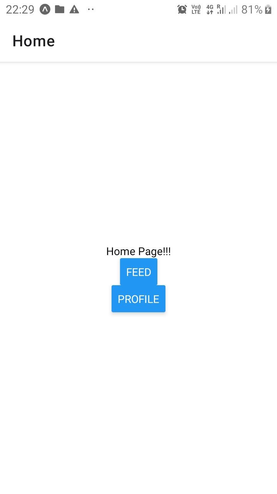
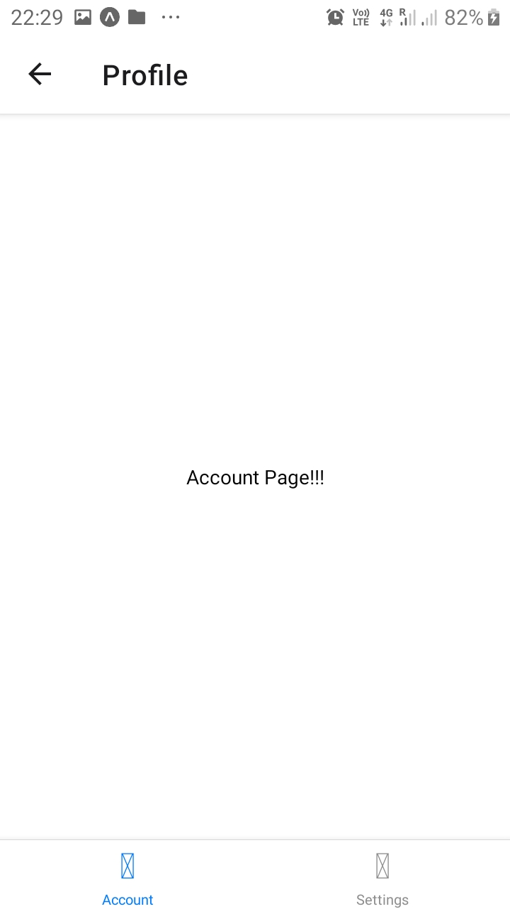
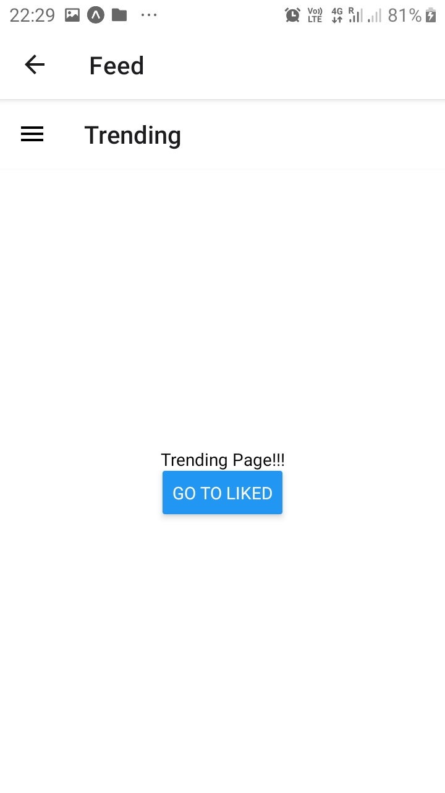
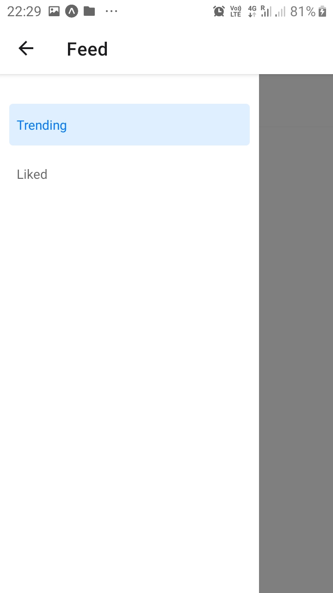

### <u> Using Context API </u>

<ul>
    <li>Change Theme based on device theme</li>
    <li>Used createContext and useContext hooks</li>
</ul>

### <u> Screenshot </u>

### 1. Stack Navigator

### 2. Tab Navigator

### 3. Drawer Navigator

